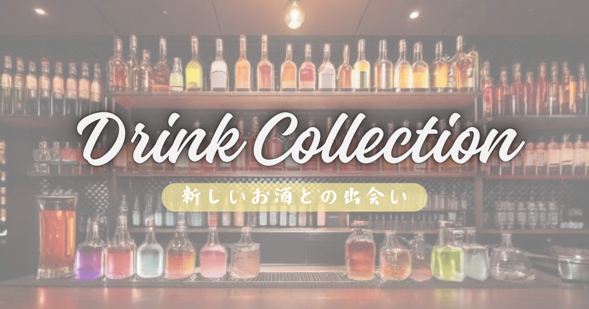

# プロジェクト名:『DrinkCollection』

# 目次
- [サービス概要](#サービス概要)
- [サービスURL](#サービスurl)
- [サービス開発の背景](#サービス開発の背景)
- [ユーザー層について](#ユーザー層について)
  - [全ユーザー](#全ユーザー)
  - [ログインユーザー](#ログインユーザー)
- [機能紹介](#機能紹介)
- [技術構成について](#技術構成について)
  - [使用技術](#使用技術)
  - [ER図](#er図)
  - [画面遷移図](#画面遷移図) 
 

# サービス概要
* このアプリはお酒の種類からどんなお酒があるのか調べられたり、検索機能でカクテルの名前からそのカクテルの作り方を調べたりできる。
* 投稿機能があり他のユーザーのおすすめのお酒が見れたり、ログインすることで自分のおすすめのお酒を投稿することができる。
* お酒があまり飲めない人やお酒は飲まないけど雰囲気を楽しみたい人のためにノンアルコールカクテルのリストを見ることができる。

# サービスURL
サービスURL：[DrinkCollection](https://drinkcollection-1.onrender.com/)

# サービス開発の背景
* 居酒屋やバーに行った時にメニューにたくさんの名前が書いてあるがどんなお酒なのかまでは載っていないため、種類が違うお酒でも一つのサイトで調べられたら楽なのにという思いがあった。
* 家でお酒を飲む時に材料はあるけど一般的な飲み方しかわからないといった時に、お酒からどんなカクテルが作れるかわかると便利だと思った。
* 飲みたいお酒や飲んだお酒を調べるが、次の機会が訪れた時にはそれがなんだったのか忘れていることがよくある。そのため、調べたお酒を保存しておけると次の機会がきたときにリストを確認するだけなので便利になると思った。

# ユーザー層について
* お酒が好き、お酒はあまり飲めないが雰囲気は楽しみたいというようなすべての人に提供できるものにしたい。

## 全ユーザー
* カテゴリを選択することで日本酒、焼酎、カクテルなどのお酒を調べることができる。
* 検索フォームを使用し、お酒の名前からどんな材料で作られているのか調べることができる。
* カクテルの材料から作れるお酒を調べることができる。

## ログインユーザー
### 全ユーザーの機能に加えて、以下の機能の使用ができます
* ユーザーのおすすめしたいお酒の投稿を作成することができる。
* 検索したお酒のリストをブックマークすることで、マイページからいつでも見返すことができる。
* ユーザーの作成した投稿をSNSに共有することができる。

# 技術構成について
## 使用技術
|カテゴリ|技術内容|
|:-------:|:------|
| フロントエンド | Ruby on Rails, JavaScript, HTML |
| バックエンド | Ruby on Rails 7.1.5, Ruby 3.2.3 |
| CSSフレームワーク | Tailwindcss + DaisyUI |
| Web API | Google API, 楽天API |
| データベース | PostgreSQL |
| ファイルサーバー | AWS S3 |
| インフラ | Render |
| バージョン管理ツール | GitHub, Git |
| 開発環境 | Docker |

### 画面遷移図
Figma:https://www.figma.com/design/T8h8Ip2hjykp1Qred8czzz/DrinkCollection?node-id=0-1&t=mpuSaWUpAWyEGnsG-1

### ER図
https://dbdiagram.io/d/6744aec7e9daa85acaa7ee29
